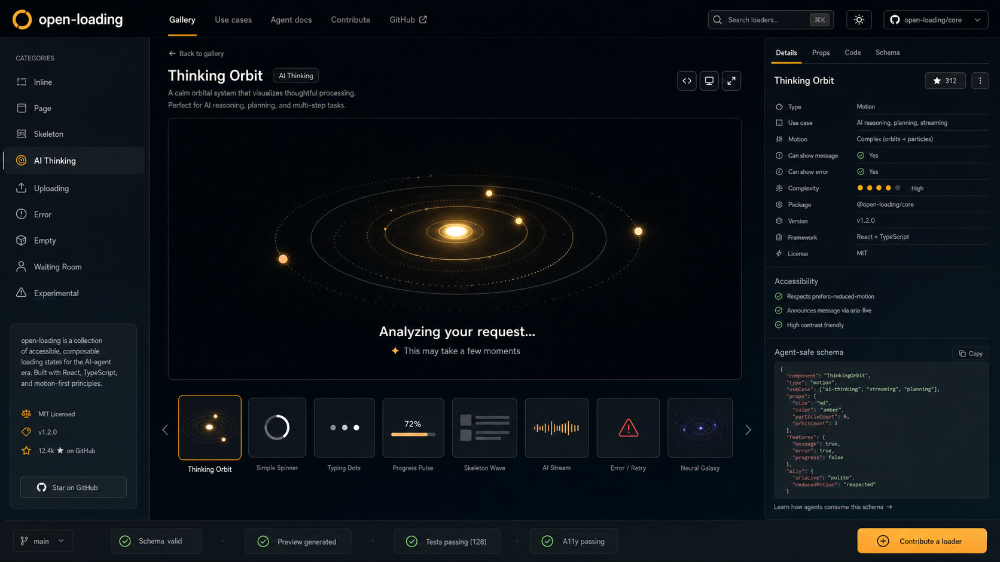

# open-loading

`open-loading` is an agent-first loading-state library for React products. It ships accessible loading components, a cinematic gallery, and machine-readable metadata so humans and AI coding agents can add new loaders without guessing the repo shape.



## Install

```bash
npm install @open-loading/react
```

The published npm package is `@open-loading/react`. This workspace uses `pnpm` for development, but app users can install the library with npm like any other React dependency.

Use a loader directly in React:

```tsx
import { ThinkingOrbit } from "@open-loading/react";

export function PendingState() {
  return (
    <ThinkingOrbit
      message="Analyzing your request..."
      size="lg"
      tone="brand"
    />
  );
}
```

## Quickstart

```bash
pnpm install
pnpm dev
```

The gallery runs through Vite from `apps/gallery`. For a production preview:

```bash
pnpm build:gallery
```

Then serve `apps/gallery/dist` with any static server.

## Project Shape

- `packages/core` contains the React loader package published as `@open-loading/react`.
- `apps/gallery` contains the cinematic docs/gallery app.
- `templates/loader` contains the required starting point for new loader contributions.
- `docs/concepts/open-loading-cinematic.png` is the approved visual direction for the gallery.

## Loader Contract

Every loader must include:

- a React component exported from `packages/core/src/loaders`.
- a metadata entry in `packages/core/src/registry/definitions.ts`.
- accessibility notes, reduced-motion behavior, and documented props.
- a gallery preview through the registry.
- tests for rendering, message behavior, and any error mode.

The registry is validated with:

```bash
pnpm validate
```

## Development

```bash
pnpm install
pnpm dev
```

Run the same checks CI runs:

```bash
pnpm check
```

## Public API

```tsx
import {
  ThinkingOrbit,
  SimpleSpinner,
  TypingDots,
  ProgressPulse,
  QueueBeacon,
  SkeletonWave,
  AIStream,
  ErrorRetry,
  NeuralGalaxy,
  loaders,
  getLoaderById
} from "@open-loading/react";
```

Common loader props:

```ts
type LoaderProps = {
  message?: string;
  error?: string | boolean;
  size?: "sm" | "md" | "lg";
  tone?: "neutral" | "brand" | "success" | "warning" | "danger";
  reducedMotion?: boolean;
  className?: string;
};
```

## Agent Contribution Philosophy

AI agents are welcome contributors, but every change must be structured. Add one loader at a time, keep metadata precise, respect reduced motion, and run the validation script before opening a PR.

See [AGENTS.md](AGENTS.md) and [CONTRIBUTING.md](CONTRIBUTING.md).

## Public Repo Setup

This local v0 is prepared for the public GitHub repo at `Arthav/open-loading`:

```bash
git remote -v
git push -u origin main
```

Before publishing, keep the `repository`, `homepage`, and `bugs` fields in `package.json` and `packages/core/package.json` aligned with that repo.

## Publish Readiness

Only `packages/core` is intended for npm. The root package stays private because it owns the workspace and gallery.

Publishing as `@open-loading/react` requires npm access to the `@open-loading` scope. If you do not control that scope, update `packages/core/package.json` to a package name you control before publishing.

Dry-run the package before publishing:

```bash
pnpm check
pnpm pack:core
```

When the dry-run looks right, publish from the package directory:

```bash
cd packages/core
npm publish --access public
```
